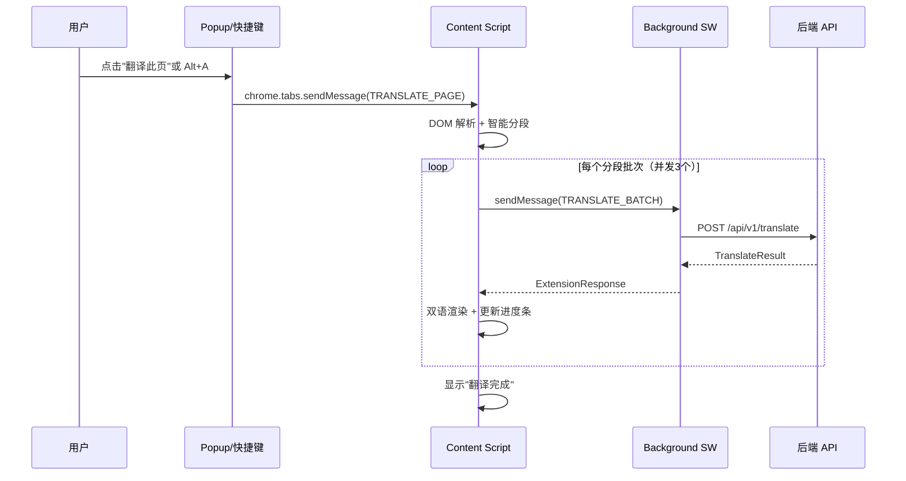

# 整页翻译功能开发计划

## 一、现有扩展需优化的问题

通读了全部扩展代码，发现以下必须处理的问题：

### 1. `autoTranslate` 设置未生效

- [settings.ts](packages/extension/utils/settings.ts) 定义了 `autoTranslate` 字段，Popup 中也有对应开关
- 但 [content.ts](packages/extension/entrypoints/content.ts) 的 `mouseup` 监听器中 **从未检查此设置**
- 当用户关闭"选中文本自动翻译"后，划词触发图标仍然会出现
- **修复**：在 `mouseup` handler 中先通过消息获取 `autoTranslate` 设置，为 `false` 时不显示触发图标

### 2. `contextMenus` 权限缺失

- 手册 4.1 列出需要 `contextMenus` 权限用于"右键翻译选中文字"
- [wxt.config.ts](packages/extension/wxt.config.ts) 只声明了 `activeTab` 和 `storage`
- **修复**：添加 `contextMenus` 权限，并在 `background.ts` 中注册右键菜单项

### 3. Popup 功能过于单薄

- 当前 [App.tsx](packages/extension/entrypoints/popup/App.tsx) 只有设置功能
- 手册要求 Popup 中有「翻译此页」按钮作为整页翻译入口
- **修复**：重构 Popup，增加操作区（翻译此页按钮 + 还原按钮）

---

## 二、整页翻译功能开发

### 核心架构




### 需要新增/修改的文件

**新增文件：**

- `packages/extension/utils/dom-parser.ts` — DOM 文本提取
  - 遍历页面 DOM 树，提取所有可见的文本块元素
  - 跳过 `script`、`style`、`code`、`pre`、`noscript`、`svg`、`textarea`、`input` 等标签
  - 跳过不可见元素（`display:none`、`visibility:hidden`、`offsetHeight===0`）
  - 返回 `{element: HTMLElement, text: string}[]`
- `packages/extension/utils/segmenter.ts` — 智能分段
  - Token 估算逻辑：1 中文字 ≈ 2 token，1 英文词 ≈ 1.5 token
  - 将文本块分组，每组 ≤ 1500 token
  - 返回分段批次，每个批次包含元素引用和对应文本
- `packages/extension/utils/page-translator.ts` — 整页翻译调度器
  - 类 `PageTranslator`，管理翻译状态（idle/translating/done）
  - 调用 dom-parser 提取文本 -> segmenter 分段 -> 并发翻译
  - 并发控制：同时最多 3 个请求（`Promise.allSettled`）
  - 进度回调：每完成一个批次更新百分比
  - 失败容错：单个批次失败不阻断其他批次
  - 提供 `restore()` 方法移除所有译文节点
- `packages/extension/utils/renderer.ts` — 双语渲染
  - 在原文元素下方插入译文节点（独立 `<div>`）
  - 译文样式：浅蓝背景、缩进、不同字色，与原文视觉区分
  - 所有插入的节点统一加 `data-tom-translate` 属性，便于一键还原
  - `display:block` 独立成行，不影响原文布局
- `packages/extension/utils/progress-ui.ts` — 进度指示 UI
  - 页面右下角浮动进度条（Shadow DOM 隔离，不影响页面样式）
  - 显示翻译完成百分比和已翻译/总计段落数
  - 提供"还原"按钮
  - 翻译完成后自动收起或显示已完成状态

**修改文件：**

- `packages/extension/entrypoints/content.ts`
  - 导入 `PageTranslator`
  - 监听来自 Popup/Background 的 `TRANSLATE_PAGE` 消息
  - 增加 `autoTranslate` 设置检查
  - 实例化并管理 `PageTranslator` 生命周期
- `packages/extension/entrypoints/background.ts`
  - 增加 `TRANSLATE_BATCH` 消息处理：接收多段文本，调用后端 `/api/v1/translate`
  - 增加右键菜单注册逻辑
  - 增加 Alt+A 快捷键命令处理
- `packages/extension/entrypoints/popup/App.tsx`
  - 增加"翻译此页"按钮区域
  - 增加"还原页面"按钮
  - 显示当前页面翻译状态
- `packages/extension/wxt.config.ts`
  - 添加 `contextMenus` 权限
  - 添加 `commands` 配置（Alt+A 快捷键）
- `packages/extension/utils/api.ts`
  - 新增 `translateBatch()` 函数：支持传入文本数组批量翻译

**共享类型更新：**

- `shared/src/index.ts`
  - 确认 `TRANSLATE_PAGE` 和 `TRANSLATE_BATCH` 消息类型已定义（已有，无需改动）

### 关键实现细节

**并发翻译策略：**

```typescript
async function translateInBatches(batches, concurrency = 3) {
  for (let i = 0; i < batches.length; i += concurrency) {
    const chunk = batches.slice(i, i + concurrency);
    const results = await Promise.allSettled(
      chunk.map(batch => translateBatch(batch))
    );
    // 处理结果、更新进度、渲染译文
  }
}
```

**双语渲染示例：**

```html
<p>This is the original English text.</p>
<div data-tom-translate class="tom-translate-result">
  这是原始的英文文本。
</div>
```

**还原逻辑：**

```typescript
document.querySelectorAll('[data-tom-translate]').forEach(el => el.remove());
```

---

## 三、执行手册同步更新

更新 [01_项目完整执行手册.md](Tom_TranslateApp/01_规划阶段/01_项目完整执行手册.md) 的以下部分：

- 4.2 节：将开发顺序从"计划"改为"已完成"状态，补充实际实现的技术细节
- 4.3 节：更新扩展内部通信协议，补充 `TRANSLATE_BATCH` 的实际用法
- 新增 4.5 节：整页翻译实现细节（DOM 解析策略、分段算法、并发控制、双语渲染）
- 新增 4.6 节：扩展目录结构更新（反映新增的 utils 文件）
- 检查清单：更新第 4 周末和第 6 周末的完成状态

