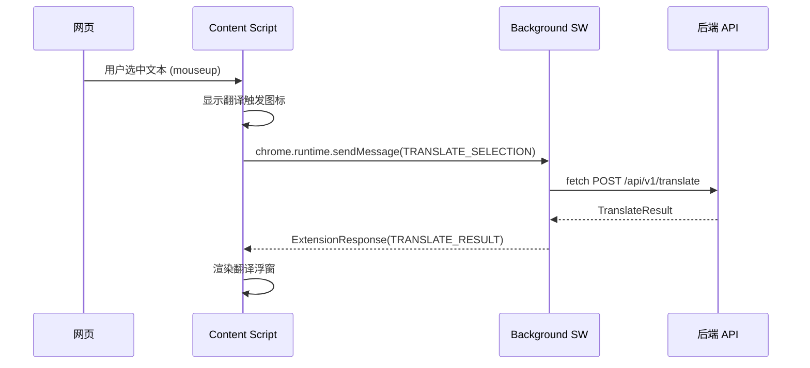

# 前三步评估 + 第四步浏览器扩展开发计划

---

## 一、前三步评估：需要修补的问题

### 1.1 必须修补（影响扩展开发）

**问题 A：`shared/` 类型库未被 `web` 引用**

- `shared/src/index.ts` 已定义完整的类型（含扩展通信协议），但 `packages/web/src/lib/types.ts` 是一份独立副本
- 两份类型将来不同步会导致 bug
- **修复**：让 `packages/web` 依赖 `shared` 包，删除 `web/src/lib/types.ts`，从 `shared` 导入

**问题 B：后端未做输入长度校验**

- 前端限制 5000 字符，但后端 `TranslateRequest` 无任何限制
- 扩展或恶意调用者可以发送超长文本，导致 API 费用飙升
- **修复**：在 [packages/backend/app/services/engines/base.py](packages/backend/app/services/engines/base.py) 的 `TranslateRequest` 中增加 pydantic 字段校验（`texts` 列表长度上限 + 单条文本长度上限）

### 1.2 建议修补（不阻塞但值得做）

**问题 C：`source_lang` 为 "auto" 时不返回实际检测到的语言**

- 翻译结果的 `source_lang` 始终是请求传入的值（如 "auto"），前端无法知道实际检测到的是什么语言
- 不影响功能，但影响用户体验（扩展浮窗显示"检测到的语言"时没有值可用）

**问题 D：限流配置已定义但未实施**

- `config.py` 有 `rate_limit_per_minute` / `free_daily_`* 等配置项，但没有任何中间件或逻辑执行限流
- MVP 阶段可暂不处理，但上线前必须补上

**问题 E：后端缺少日志**

- 没有结构化日志，生产环境排查问题困难
- MVP 阶段可暂缓

---

## 二、第四步方案评估

手册中第四步的规划**合理且可行**：

- **WXT 框架选型正确**：基于 Vite，支持热重载，TypeScript 原生支持，同时兼容 Chrome/Firefox/Edge
- **开发顺序合理**：先做划词翻译（功能独立、可快速验证通信链路），再做整页翻译（依赖更多基础设施）
- **通信架构正确**：Content Script -> Background Service Worker -> 后端 API 的三层架构是 Manifest V3 的标准做法
- `**shared/` 已预置通信类型**：`ExtensionMessage` / `ExtensionResponse` 等类型已定义好

---

## 三、第四步实施：划词翻译开发

### 3.1 技术架构




### 3.2 扩展目录结构

```
packages/extension/
├── entrypoints/
│   ├── background.ts           # Service Worker：消息中转 + API 调用
│   ├── content.ts              # Content Script：选词监听 + UI 渲染
│   └── popup/
│       ├── index.html          # Popup 页面入口
│       ├── App.tsx             # Popup React 组件
│       └── main.tsx            # Popup 入口脚本
├── components/
│   ├── TranslationBubble.tsx   # 翻译浮窗组件（Shadow DOM 隔离）
│   └── TriggerIcon.tsx         # 选中文本后的触发图标
├── utils/
│   ├── api.ts                  # 复用/适配后端 API 调用逻辑
│   └── settings.ts             # chrome.storage.local 设置读写
├── assets/
│   └── icon.png                # 扩展图标 (16/32/48/128)
├── wxt.config.ts               # WXT 框架配置
├── tailwind.config.ts          # Tailwind 配置
└── package.json
```

### 3.3 核心实现要点

**background.ts** — 消息中转 + API 调用

- 监听来自 Content Script 的 `chrome.runtime.onMessage`
- 根据消息类型（`TRANSLATE_SELECTION` / `GET_SETTINGS` / `SAVE_SETTINGS`）分发处理
- 直接 `fetch` 后端 API（Background 不受 CORS 限制）
- 返回结果给 Content Script

**content.ts** — 选词监听 + UI 注入

- 监听 `mouseup` 事件，用 `window.getSelection()` 获取选中文本
- 选中文本后在鼠标位置附近显示翻译触发图标
- 点击图标后发送消息到 Background，等待翻译结果
- 使用 **Shadow DOM** 渲染翻译浮窗，避免与宿主页面的 CSS 冲突
- 点击浮窗外部或按 Esc 关闭浮窗

**popup/** — 扩展弹窗设置页

- 显示默认引擎选择
- 显示默认目标语言选择
- 后端 API 地址配置
- 使用 `chrome.storage.local` 持久化

**utils/settings.ts** — 设置存储

- 封装 `chrome.storage.local` 的读写
- 复用 `shared/` 中的 `UserSettings` / `DEFAULT_USER_SETTINGS` 类型

### 3.4 修补前三步问题（扩展开发前置条件）

在开始扩展开发前，需要先修补问题 A 和 B：

- 让 `web` 引用 `shared` 类型，确保扩展、web、shared 三方类型一致
- 后端增加输入校验，防止扩展端发送超长文本

